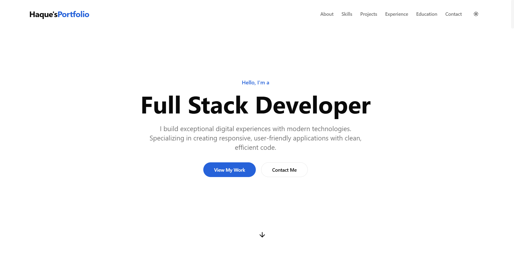

# Haque's Portfolio - A Modern Developer Portfolio 🚀

<div align="center">
  
</div>

<div align="center">
  <p>
    <em>My personal portfolio website, where I showcase my skills, projects, and experience. Built with Next.js</em>
  </p>
  <h3>
    <a href="https://haque-lake.vercel.app/" target="_blank">🌐 View Live Demo</a>
  </h3>
</div>

---

## 👋 Introduction

Hello! I'm Maksudul Haque, a Full-Stack Developer. This portfolio has been created as a modern and responsive platform to showcase my work, skills, and technological expertise. My goal is to present my best work through clean design and a user-friendly interface.

---

## ✨ Key Features

* 🎨 **Modern & Clean Design**: A delightful experience for users.
* 📱 **Fully Responsive**: Works seamlessly on all devices (desktop, tablet, mobile).
* 🌙 **Dark/Light Mode**: Theme-switching capability according to user preference.
* 🔄 **Smooth Animations**: Attractive transitions and animations using Framer Motion.
* ⚡ **Fast Performance**: Maximum dynamism powered by Next.js.
* 📊 **Project Showcase**: Detailed descriptions of my notable projects.
* 🛠️ **Skills Section**: A list of technologies and tools I am proficient in.
* 💼 **Work Experience**: A timeline of significant moments in my professional life.
* 📝 **Contact Form**: An easy way to get in touch with me.
* 🎯 **SEO Optimized**: Optimized for easy discoverability on search engines.

---

## 🛠️ Tech Stack

The modern technologies I've used to build this portfolio:

* **Framework**: [Next.js 13](https://nextjs.org/)
* **Programming Language**: [TypeScript](https://www.typescriptlang.org/)
* **CSS Framework**: [Tailwind CSS](https://tailwindcss.com/)
* **Animation**: [Framer Motion](https://www.framer.com/motion/)
* **UI Components**: [Shadcn UI](https://ui.shadcn.com/)
* **Icons**: [Lucide Icons](https://lucide.dev/)

---

## 🚀 Getting Started

If you want to run this project on your local machine:

1.  **Clone the repository:**
    ```bash
    git clone [https://github.com/maksudulhaque2000/HaqueS-Portfolio](https://github.com/maksudulhaque2000/HaqueS-Portfolio)
    ```
2.  **Install dependencies:**
    ```bash
    cd HaqueS-Portfolio
    npm install
    # or yarn install
    ```
3.  **Run the development server:**
    ```bash
    npm run dev
    # or yarn dev
    ```
4.  Visit [http://localhost:3000](http://localhost:3000) in your browser.

---

## 📂 Project Structure

HaqueS-Portfolio/
├── app/                  # Next.js app directory (routing, pages)
├── components/
│   ├── layout/           # Layout components (Navbar, Footer, etc.)
│   ├── sections/         # Page sections (Hero, About, Projects, etc.)
│   └── ui/               # Reusable UI components (Button, Card, etc.)
├── data/                 # Static data (projects, skills, experience)
├── lib/                  # Utility functions and hooks
├── providers/            # Context providers (e.g., ThemeProvider)
└── public/               # Static assets (images, fonts, etc.)

---

## 🎨 Customization

You can easily customize this portfolio to make it your own:

1.  **Personal Information**: Update your personal information in the files within the `data/` directory (e.g., `personalInfo.ts`, `projects.ts`).
2.  **Color Scheme**: Change your preferred colors in `app/globals.css` and `tailwind.config.js`.
3.  **Sections**: Add new sections or remove old ones in `app/page.tsx`.
4.  **Components**: Modify the components in the `components/` directory according to your needs.

---

## 🚢 Deployment

This project supports static exports, so it can be easily deployed to any static hosting platform (e.g., Vercel, Netlify, GitHub Pages):

1.  **Build the project:**
    ```bash
    npm run build
    ```
    After the build is complete, static files will be generated in the `out` folder (if `output: 'export'` is set in `next.config.js`). Alternatively, the default Next.js build output (the `.next` folder) will be automatically deployed on platforms like Vercel.

---

## ⚡ Performance

Emphasis has been placed on the following to ensure optimal performance of the portfolio:

* **Optimized Images**: Image optimization using Next.js's `<Image>` component.
* **Lazy Loading**: Components and images are loaded as needed.
* **Efficient Animations**: Hardware-accelerated animations from Framer Motion.
* **Minimal Bundle Size**: Fast loading by excluding unnecessary code.

---

## 📬 Let's Connect

If you like my work or want to discuss a project, feel free to contact me:

* **Email**: [smmaksudulhaque2000@gmail.com](mailto:smmaksudulhaque2000@gmail.com)
* **LinkedIn**: [linkedin.com/in/maksudulhaque2000](https://www.linkedin.com/in/maksudulhaque2000/)
* **GitHub**: [github.com/maksudulhaque2000](https://github.com/maksudulhaque2000)
* **Facebook**: [facebook.com/maksudulhaque2000](https://www.facebook.com/maksudulhaque2000)
* **YouTube**: [youtube.com/@maksudulhaque2000](https://www.youtube.com/@maksudulhaque2000)

---

## 📜 License

This project is licensed under the [MAKSUDUL HAQUE](HAQUE). Feel free to use this project to create your own portfolio!

---

<div align="center">
  <em>Thank you for your interest!</em>
  <em>Copyright ©️ 2025 [Maksudul Haque]</em>
</div>